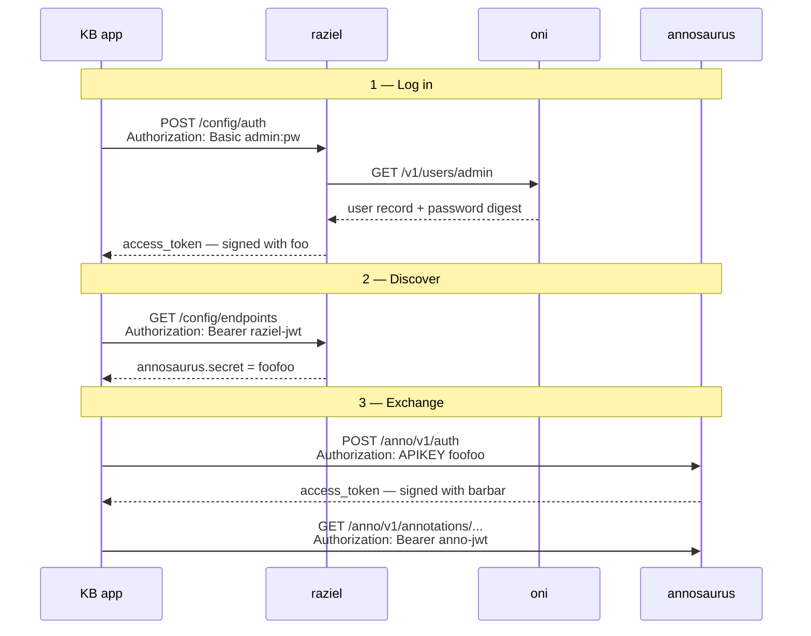

# Authentication in vars-quickstart-public

How a client gets from a username and password to an authorized call against
Annosaurus, and why each service has its own JWT signing secret.

## Short answer

The differing signing secrets are intentional. Don't match them back up.

- **Nothing needs to change in `vars-quickstart-public`.** The old m3-quickstart
  worked because Oni and Annosaurus happened to share the signing secret `bar`.
  That was a coincidence of a demo config, not a designed trust relationship.
- **Annosaurus does not need an `/auth/login` route.** It already has
  `POST /v1/auth`, which exchanges an API key for a JWT. Oni is the only service
  with `/auth/login` because Oni is the only service that owns a user table.
- **The KB app should not hardcode Annosaurus' secret.** It should fetch it from
  Raziel's `/config/endpoints` at runtime, after the user logs in. That is the
  job Raziel exists to do.
- **This is not an end-around on user authentication**, because Annosaurus never
  performed user authentication. See [Where the user actually gets
  authenticated](#where-the-user-actually-gets-authenticated).

## Two different secrets per service

Most of the confusion here comes from two similarly named variables that do
completely unrelated things.

| Variable | Role | Who holds it |
| --- | --- | --- |
| `*_BASICJWT_CLIENT_SECRET` | An **API key**. You present it to the service to *obtain* a JWT. Meant to travel. | Raziel, plus any client Raziel has authenticated |
| `*_BASICJWT_SIGNING_SECRET` | The **HMAC-512 key** the service uses to sign and verify *its own* JWTs. Never meant to leave the process. | That one service |

Current values in `etc/env/localhost.env`:

| Service | Client secret (API key) | Signing secret |
| --- | --- | --- |
| annosaurus | `foofoo` | `barbar` |
| oni | `foo` | `bar` |
| panoptes | `foofoo` | `barbar` |
| vampire-squid | `foofoo` | `barbar` |
| beholder | `foo` (`BEHOLDER_API_KEY`) | — (bare API key, no JWT exchange) |
| raziel | `inflatable_ducks` (`RAZIEL_MASTER_KEY`) | `foo` (`RAZIEL_JWT_SIGNING_SECRET`) |

Two things worth flagging about that table:

- The toy placeholders collide in a genuinely misleading way. Raziel's *signing*
  secret and Oni's *client* secret are both `foo`, and they have nothing to do
  with each other.
- `etc/env/namedhost.env` sets all of these to distinct random base64 values.
  That is the shape a real deployment takes; `localhost.env` only preserves the
  same *structure* with values that are easy to type.

### Why not one shared signing secret

With a single shared key, every service that can mint a token can mint a token
that every other service accepts. A bug or a compromise in the least privileged
service becomes write access to the annotation database. Per-service keys keep
the blast radius to one service and let you rotate one key without restarting
the fleet.

## The flow

Raziel is the only service that knows all of the other services' API keys —
`docker/compose.yml` passes them in as `ANNOSAURUS_SECRET`, `ONI_SECRET`,
`PANOPTES_SECRET`, and so on.



Each service mints and verifies its own token. The Raziel token unlocks the
catalog of API keys; each API key unlocks one service's token. No token crosses
a service boundary — which is why the signing secrets never need to match.

### 1. Log the user in at Raziel

```bash
curl -k -X POST https://localhost/config/auth \
  -u 'admin:<password>'
# → {"access_token":"<raziel-jwt>","token_type":"Bearer"}
```

Raziel resolves the user with `GET http://oni:8080/v1/users/<username>` and
checks the password against the stored Jasypt digest itself, then mints **its
own** JWT signed with `RAZIEL_JWT_SIGNING_SECRET`.

Oni is the user store here by fallback, not by configuration: `VARS_USER_SERVER_URL`
is never set in `compose.yml`, and `AppConfig.VarsUserServer` falls back to the
Oni endpoint config when Oni is configured.

> **The Raziel token is only good at Raziel.** It is signed with
> `RAZIEL_JWT_SIGNING_SECRET` (`foo`), and Oni verifies with
> `ONI_BASICJWT_SIGNING_SECRET` (`bar`). Oni will reject it. So will everything
> else. Raziel does not proxy Oni's `/auth/login` token back to you.

Raziel also accepts its master key instead of user credentials, which mints a
token for the synthetic user `master`:

```bash
curl -k -X POST https://localhost/config/auth \
  -H 'X-Api-Key: inflatable_ducks'
```

### 2. Ask Raziel for the service catalog

```bash
curl -k https://localhost/config/endpoints \
  -H "Authorization: Bearer <raziel-jwt>"
```

Returns one entry per service — `name`, `url`, `timeoutMillis`, `proxyPath`, and
`secret`. Two behaviors to know:

- Without a valid bearer token the call still succeeds, but every `secret` comes
  back `null`. Authentication is what unlocks the secrets, not the listing.
- `?internal=true` returns docker-internal URLs (`http://annosaurus:8080/v1`)
  instead of the external ones.

There are two Raziel containers, and they differ only in the URLs they hand out:
`raziel` (port 8400, and behind nginx at `/config`) returns `https://` URLs,
while `raziel-apps` (port 8401) returns `http://` URLs for desktop apps that
can't do TLS against a self-signed cert.

### 3. Exchange each service's secret for that service's JWT

```bash
curl -k -X POST https://localhost/anno/v1/auth \
  -H 'Authorization: APIKEY foofoo'
# → {"access_token":"<annosaurus-jwt>","token_type":"Bearer"}
```

Then use that token on Annosaurus:

```bash
curl -k https://localhost/anno/v1/annotations/... \
  -H "Authorization: Bearer <annosaurus-jwt>"
```

Same pattern for the other services, each with its *own* secret from step 2 and
its own token:

| Service | Auth route |
| --- | --- |
| annosaurus | `POST /anno/v1/auth` |
| oni | `POST /kb/v1/auth` |
| vampire-squid | `POST /vam/v1/auth` |
| panoptes | `POST /panoptes/v1/auth` |

The Annosaurus token is HMAC-512, carries the issuer from `VARS_JWT_ISSUER`
(`https://www.mbari.org`), expires in 24 hours, and — see below — carries no
claims at all.

## Why only Oni has `/auth/login`

Oni owns the `useraccount` table, so it is the only service that can check a
password. It exposes both routes:

- `POST /v1/auth/login` — `Authorization: Basic <base64>`. Requires the account
  to be an administrator or maintainer.
- `POST /v1/auth` — `Authorization: APIKEY <ONI_BASICJWT_CLIENT_SECRET>`.

Every other service has only the `APIKEY` route. Adding `/auth/login` to
Annosaurus would mean giving Annosaurus either its own user store or a
synchronous dependency on Oni's — which is precisely the coupling Raziel was
introduced to remove.

## Where the user actually gets authenticated

Your instinct that fetching Annosaurus' secret is "an end-around on user
authentication" is right, but it predates this change and it isn't caused by the
signing secrets.

Annosaurus authorization has always been service-level, never user-level:

- `JwtService.authorize` compares the presented API key to the configured client
  secret and, on a match, signs a token with **no claims** — no subject, no
  username, nothing but issuer, issued-at, and expiry.
- Nothing in Annosaurus' JWT or endpoint layer reads claims off a token. The
  only question it ever asks is "does this signature verify?"

So even in the old shared-`bar` setup, Annosaurus accepted the Oni token purely
because the HMAC verified. It never looked at *who* the user was. Annotation
attribution comes from the `observer` field in the request body, not from the
token.

That means the user-authentication boundary lives entirely in **step 1**, where
Raziel verifies the password against Oni's user record. Steps 2 and 3 are
capability distribution to a client that has already been authenticated.

If you want genuine per-user authorization on annotation writes — a token
Annosaurus can attribute and reject per user — that's a real feature request
against Annosaurus, and it is independent of how the signing secrets are set.
Matching the secrets back up would not get you there; it would only restore the
appearance of it.

## What this means for the KB app

**Do:** authenticate once against Raziel, hold the Raziel token for the session,
pull `/config/endpoints`, keep the per-service secrets in memory, exchange them
lazily for per-service JWTs, and re-exchange on a 401.

**Don't:** ship Annosaurus' signing or client secret in app config. That makes
the app un-deployable against a second environment without a rebuild, and makes
the secret impossible to rotate. Raziel exists so that secrets are a deployment
detail the app discovers at runtime.

## Verifying it end to end

```bash
./varsq configure etc/env/localhost.env
./varsq start

RAZIEL=https://localhost/config

# 1. user credentials -> raziel token
TOKEN=$(curl -sk -X POST "$RAZIEL/auth" -u "admin:$PASSWORD" | jq -r .access_token)

# 2. raziel token -> per-service secrets
curl -sk "$RAZIEL/endpoints" -H "Authorization: Bearer $TOKEN" \
  | jq -r '.[] | "\(.name)\t\(.secret // "-")\t\(.url)"'

# 3. annosaurus secret -> annosaurus token
SECRET=$(curl -sk "$RAZIEL/endpoints" -H "Authorization: Bearer $TOKEN" \
  | jq -r '.[] | select(.name=="annosaurus") | .secret')
ANNO=$(curl -sk -X POST https://localhost/anno/v1/auth \
  -H "Authorization: APIKEY $SECRET" | jq -r .access_token)

# 4. use it
curl -sk https://localhost/anno/v1/annotations/videoreference/<uuid> \
  -H "Authorization: Bearer $ANNO"
```

`-k` is needed because the quickstart's nginx uses a self-signed certificate for
`localhost`.

To confirm the negative case — that the two tokens are not interchangeable —
present the Raziel token to Oni and watch it fail:

```bash
curl -sk -o /dev/null -w '%{http_code}\n' https://localhost/kb/v1/concept \
  -H "Authorization: Bearer $TOKEN"
```

## Source references

| Behavior | Source |
| --- | --- |
| Raziel `/auth`, master key, user lookup | `raziel:src/main/scala/org/mbari/raziel/api/AuthController.scala` |
| Raziel `/endpoints`, secret redaction | `raziel:src/main/scala/org/mbari/raziel/api/EndpointsController.scala` |
| Oni fallback as user store | `raziel:src/main/scala/org/mbari/raziel/AppConfig.scala` |
| Password check (Jasypt) | `raziel:src/main/scala/org/mbari/raziel/domain/User.scala` |
| Oni `/auth` and `/auth/login` | `oni:oni/src/main/scala/org/mbari/oni/endpoints/AuthorizationEndpoints.scala` |
| Annosaurus `/auth` (APIKEY only) | `annosaurus:annosaurus/src/main/scala/org/mbari/annosaurus/endpoints/AuthorizationEndpoints.scala` |
| Claimless token minting | `annosaurus:annosaurus/src/main/scala/org/mbari/annosaurus/etc/jwt/JwtService.scala` |
